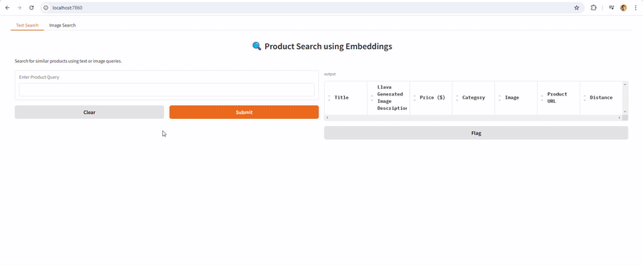

# **Product Search with Text and Image Embeddings**

This project enables product search using both text and image embeddings.

## **Preview of the Final App**


---

## **Steps to Run the Application**

### **1. Set Up Docker Containers**
The application runs using Docker containers for MongoDB (for storing product information) and Gradio (for web-based UI). Start by running docker-compose:

```sh
docker-compose up --build -d
```

---

### **2. Dataset Preparation**
The final dataset is available at: ```dataset/textual/complete/final_products.csv```

This file contains **10,200 items**. To build or expand this dataset, follow these steps:

#### **i) Dataset Generation**
- The dataset is derived from **Amazon Products Dataset (+1M Products)** on [Kaggle](https://www.kaggle.com/datasets/aaronfriasr/amazon-products-dataset?select=amazon_products.csv).
- The dataset generation script is available in the notebook: ```dataset_generate.ipynb```

#### **ii) Generating Product Descriptions**
- Although the titles in the dataset are somewhat descriptive, actual product descriptions were missing. Therefore a Visual Language model **Llava-1.5-13b-hf** with 4-bit quantization was used to generate image captions as an alternative. These were added to the dataset. The script for generating image captions is available in: ```Llava Caption Generator.ipynb```

---

### **3. Deploy the Nvidia Triton Server from Docker Image**
This project uses an **RTX A5000** Runpod instance. However, a smaller instance may also be used.

#### **Steps to Set Up**
1. Pull the Triton official Docker image:

   ```sh
   docker pull nvcr.io/nvidia/tritonserver:24.01-py3
   ```
If using Runpod, use this image as a template instead.

2. Once the image loads, run:

   ```sh
   apt-get update && apt-get install -y pkg-config libcairo2-dev python3-dev git
   pip install --no-cache-dir gdown
   git clone https://github.com/Shahrukh95/Product-Search-With-Text-and-Image-Embeddings.git
   cd Product-Search-With-Text-and-Image-Embeddings/Triton Server
   gdown --folder https://drive.google.com/drive/folders/1E2D2ekxGa4uQ2mu9zrURKb3f8l85fFjS -O model_repository
   pip install --no-cache-dir -r requirements.txt
   chmod +x start.sh
   bash start.sh
   ```

This will:
- Download the **optimized ONNX models** for text and image embeddings. The `config.pbtxt` files for both models have been defined. This includes the batch size, input/output layers and the backend runtime. To check how these models were obtained refer to the [ONNX Model Creation](#onnx-model-creation) section.
- Start the **Triton server** and **Flask app**.

Make sure the following ports are open:
- **Port 8000** → Triton Server (HTTP requests only)
- **Port 5000** → Flask App

#### **Model Input Batch Sizes**
- **Text Model:** Supports **128 inputs** per batch (`config.pbtxt`).
- **Image Model:** Supports **64 inputs** per batch (`config.pbtxt`).

---

### **4. Build the Text and Image Embeddings**
Once the **Flask API** for the Triton Server is running, generate embeddings by running the notebook: ```Generate All Embeddings.ipynb```
The notebook will generate text and image embeddings for the entire database and store them in a FAISS index for fast similarity search.

---

### **5. Build the MongoDB Product Database**
MongoDB stores all **product metadata**. The database schema is:

```
{
  "text_embedding_index": idx,   // Integer: Stores the FAISS text index.
  "image_embedding_index": idx,  // Integer: Stores the FAISS image index.
  "asin": row["asin"],           // String: Amazon Standard Identification Number (ASIN).
  "title": row["title"],         // String: Product title.
  "imgUrl": row["imgUrl"],       // String: URL of the product image.
  "productURL": row["productURL"], // String: URL of the product page.
  "price": float(row["price"]),  // Float: Price of the product.
  "category": {
    "id": row["category_id"],    // String: ID of the product category.
    "name": row["category_name"] // String: Name of the product category.
  },
  "product_description_ai_generated": row["llava_generated_image_caption"] // String: AI-generated description of the product.
}
```

To create and populate the database run the script: ```load_mongodb.py```

---

### **6. Run the Gradio App Locally**
Once the Docker containers are running from **Step 1**, the app should launch automatically.

If using **Runpod**, update the API endpoint. Your endpoint will be of the format: ```https://{YOUR-RUNPOD-ID}-5000.proxy.runpod.net/```

---

## **ONNX Model Creation**
The project uses two models:

1. **Text Embeddings:** [WhereIsAI/UAE-Large-V1](https://huggingface.co/WhereIsAI/UAE-Large-V1)
2. **Image Embeddings:** [nomic-ai/nomic-embed-vision-v1.5](https://huggingface.co/nomic-ai/nomic-embed-vision-v1.5)

- The **UAE-Large-V1** model was converted to ONNX using the `ORTModelForFeatureExtraction` library from HuggingFace. Conversion script: ```Triton Server/ONNX Resources/UAE-Large-V1.ipynb```

- The **nomic-embed-vision-v1.5** model was **downgraded** from **ONNX IR v10 to v9** because Triton does not support v10. Conversion script: ```Triton Server/ONNX Resources/nomic-embed-vision-v1.5.ipynb```

---

